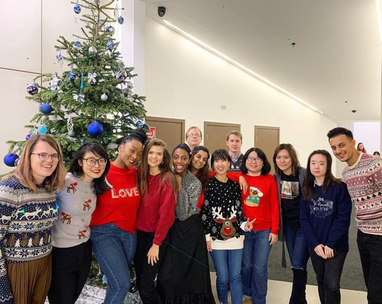

# About

Hi, I am Patty. I’m actively seeking job opportunities.

I have 6 years of experience working in software development. My experience expands on full stack web development using Ruby, Javascript and backend system development using Java. I am enthusiastic about diving into new technologies and building software systems. I like to solve problems through organized and elegant code.

I had a career gap to focus on taking care of my baby and family. Now I am ready and excited to resume my career in the software development field that I am deeply passionate about. I am looking for a role where I can apply my expertise and pursue long-term professional growth.

`#womanprogrammer`
`#womanintech`
`#workingmom`

# Working Experience

## Full Stack Engineer
[Wearisma](https://www.wearisma.com/)

At Wearisma, a UK-based startup, I have gained valuable expertise in web application development using Ruby and Javascript.

In addition to the many achievements I've finished in the fast-paced working environment, some major changes also happened to my life. First, I moved from Taiwan to Vancouver, Canada due to personal reasons. Thanks the company for giving me the opportunity to keep working for them remotely in a totally different timezone. Second, I got pregnant and was excited to welcome the new family member in the new country. After I gave birth to my baby, I decided to pursue my career locally in Canada once my maternity leave ends. Therefore, I left the position at Wearisma.

* * *

## Software Engineer
[Netbase Solutions](https://netbasequid.com/) (Now NetBase Quid)

NetBase is a company that provides social listening solutions, headquartered in the Bay Area, California. My role here was to develop the backend system, focused on the Natural Language Processing component, using Java. My daily responsibilities include:
- applying software engineering knowledge to ensure the NLP system is efficient and robust to process large scale social media text data
- evaluating and integrating 3rd party APIs or new technologies into the system
- collaborating with in-house linguists to develop the rule-based component.

I've gained valuable experiences working with team across country. It was also the first time I set my foot on the land of Americas. I had chances to visit Silicon Valley and gather with coworkers annually.

* * *

## Software Engineer
[Garmin](https://www.garmin.com/)

The first job after I graduated was to develop system software of consumer electronic products at Garmin. It was an incredible experience to participate and see how the electronic products are manufactured. But soon after, an alumni from my lab offered me an opportunity to work at NetBase Solutions, where I can apply the NLP expertise I acquired during graduate school. I made the decision to seize this new opportunity.

# Education

## Master of Science in Computer Science
National Tsing Hua University, Taiwan \
[NLP Lab](https://www.nlplab.cc/)

## Exchange Student
Kyoto University, Japan

## Bachlor of Science in Computer Science
National Tsing Hua University, Taiwan
