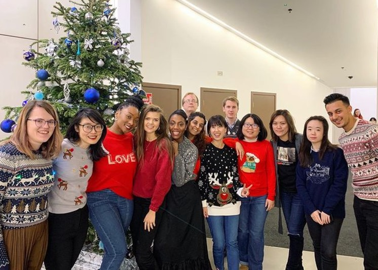
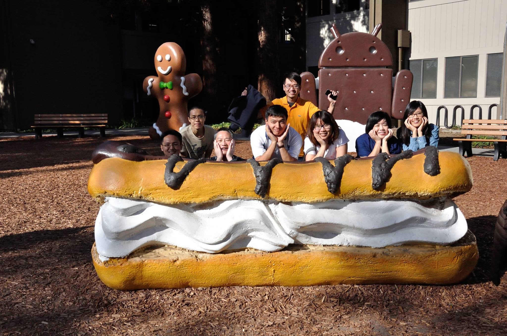
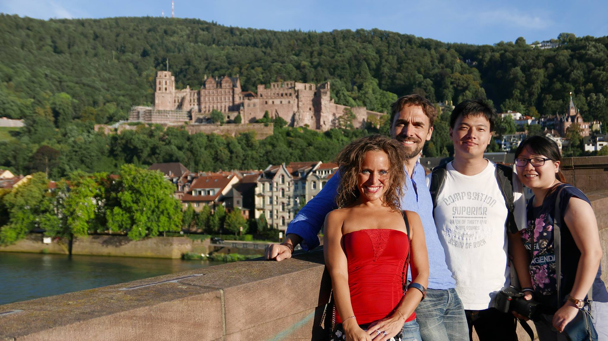

<h1 id="about" class="anchor">About</h1>

Hi👋, I am Patty. I’m actively seeking job opportunities.

I have 6 years of experience working in software development. My experience expands on full stack web development using Ruby, Javascript and backend system development using Java. I am enthusiastic about diving into new technologies and building software systems. I like to solve problems through organized and elegant code.

I had a career gap to focus on taking care of my baby and family. Now I am ready and excited to resume my career in the software development field that I am deeply passionate about. I am looking for a role where I can apply my expertise and pursue long-term professional growth.

`#womanprogrammer #womanintech #workingmom`

***

# Working Experience

<h2 id="wearisma" class="anchor">Full Stack Engineer</h2>
Remote from Vancouver, Canada | [WeArisma](https://www.wearisma.com/) \
`#Ruby #Javascript #CSS #Python #MongoDB #Elasticsearch #Heroku #GitHub`

At WeArisma, a UK-based startup, I have gained valuable expertise in web application development using Ruby and Javascript. The company's product is a platform for marketing professionals to manage and analyze their influencer marketing events on social media. Here are the accomplishments of my role,

<dt>Backend</dt>
- Utilized NoSQL databse technology such as `MongoDB` to store and operate the large-volume data.
- Implemented the search feature using `Elasticsearch` to help the clients navigate through the massive social influencer database.
- Developed system pipeline with scheduled jobs, queues, and workers, enabling asynchronous processing of the system.
- Implemented `RESTful API` and `microservices` for machine learning systems.

<dt>Front-end</dt>
- Created intuitive user interfaces using front-end technologies such as `HTML`, `Javascript`, `CSS` and `Sass`.
- Produced interactive data visualization using `D3.js`, enabling advanced analyzing and reporting features within the application.
- Cultivated auto-generated PDF reports with rich charts and vibrant contents using <a href="https://github.com/prawnpdf/prawn">prawn library</a> in Ruby.

<dt>Data Science / Machine Learning</dt>
- Social media influencer mining and classification
- Theme detection and keyword extraction
- Audience composition detection and classification

Working at the start-up, I had the opportunity to immerse myself in various aspects of technology. I enjoyed the efficiency and challenging nature of working in a fast-paced working environment. I also enjoyed working closely with client-facing colleagues to deliver features that highly aligned with clients' needs.

<em>
Year-end gathering at London, UK
</em>

***

<h2 id="nb" class="anchor">Software Engineer</h2>
Taipei, Taiwan | Netbase Solutions (Now [NetBase Quid](https://netbasequid.com/)) \
`#Java #Maven #NLP #XML #Git #Jenkins #Jira`

NetBase is a company that provides social listening solutions, headquartered in the Bay Area, California. My role here was to develop the backend system, focused on the Natural Language Processing (NLP) component, using Java. My daily responsibilities include:
- Applying software engineering knowledge to ensure the NLP system is efficient and robust to process large scale social media text data within distributed system.
- Evaluating and integrating 3rd party APIs or new technologies into the system, expanding language support for NLP processing from 7 to 15 languages.
- Collaborating with in-house linguists to develop the rule-based NLP system. Programmed and optimized logics for parsing and utilizing the rules. Developed the internal tools to visualize NLP parsing results.

I've gained valuable experiences working with teams across the globe. The company also gave us the opportunity to visit the headquarter at Silicon Valley and gather with off-shore coworkers annually. It was the first time I set foot on the land of the Americas!

<em>
Business trip to Mountain View, CA, US
</em>

<em>
Worked with linguists at Heidelberg, Germany
</em>

***

<h2 id="garmin" class="anchor">Software Engineer</h2>
Taipei, Taiwan | [Garmin](https://www.garmin.com/) \
`#C #EmbeddedSystem #Git`

The first job after I graduated was to develop system software of consumer electronic products at Garmin. It was an incredible experience to participate and see how the electronic products are manufactured. But soon after, an alumni from my lab offered me an opportunity to work at NetBase Solutions, where I can apply the NLP expertise I acquired during graduate school. I made the decision to seize this new opportunity.

***

<h1 id="ed" class="anchor"> Education </h1>

## 🎓 Master of Science in Computer Science
National Tsing Hua University, Taiwan \
[NLP Lab](https://www.nlplab.cc/)

<dt>Research Direction</dt>
Specialized in NLP. Built a knowledge extraction system to mine terminologies and their definitions from large corpus, disambiguating and clustering the meanings by semantic features. \
`#Python #nltk #flask #MySQL #SQL`

<dt>Teaching Assistant</dt>
Search Engine \
Natural Language Processing Lab. \
Machine Translation

## 🎓 Exchange Student
Kyoto University, Japan

## 🎓 Bachlor of Science in Computer Science
National Tsing Hua University, Taiwan

<dt>Senior Year Project</dt>
A streaming system with auto-scale ability. Written in Java and built on AWS EC2.

***

Thank you for visiting my webpage. Feel free to contact me via following methods.

